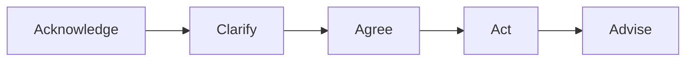

# Kundenkommunikation

Hier findest du alles zu professioneller Kommunikation im Support: Gesprächsstruktur, Deeskalation und bewährte Kommunikationsmodelle. Mit konkreten Dialogbeispielen für typische Situationen.

---

## Das Wichtigste

- **Service-Mindset:** Empathie + Klarheit + Verbindlichkeit
- **Gesprächsstruktur:** Acknowledge → Clarify → Agree → Act → Advise
- **Deeskalation:** Zuhören, Verständnis zeigen, Lösung anbieten
- **GFK (4 Schritte):** Beobachtung → Gefühl → Bedürfnis → Bitte
- **4-Ohren-Modell:** Jede Nachricht hat 4 Seiten (Sachinhalt, Appell, Beziehung, Selbstoffenbarung)

---

## Die drei Säulen guter Kommunikation

Gute Kommunikation im IT-Support ist mehr als freundlich sein. Sie basiert auf drei Säulen, die zusammen ein professionelles Auftreten ergeben. Wenn eine fehlt, leidet die gesamte Interaktion.

### 1. Empathie

Empathie bedeutet, die Situation aus der Perspektive des Users zu sehen. Der User hat ein Problem, das ihn an seiner Arbeit hindert – vielleicht steht er unter Zeitdruck, vielleicht hat er Ärger mit seinem Chef, vielleicht versteht er nicht, was passiert.

**Warum ist das wichtig?** Ein User, der sich verstanden fühlt, ist kooperativer. Er gibt dir bessere Informationen und akzeptiert auch längere Wartezeiten.

**Praktische Umsetzung:**

- Versetze dich in die Lage des Users: Was bedeutet das Problem für ihn?
- Anerkenne die Frustration, ohne sie zu verstärken
- Vermeide Sätze wie „Das ist doch nicht so schlimm" – für den User ist es schlimm

**Beispielsätze:** „Ich verstehe, dass das frustrierend ist." / „Das ist ärgerlich, besonders wenn man unter Zeitdruck steht."

### 2. Klarheit

Klarheit bedeutet, verständlich zu kommunizieren. Viele IT-Supporter reden in Fachbegriffen, die der User nicht versteht – das schafft Distanz und Unsicherheit.

**Warum ist das wichtig?** Der User muss verstehen, was passiert und was von ihm erwartet wird. Unklarheit führt zu Missverständnissen und Rückfragen.

**Praktische Umsetzung:**

- Vermeide IT-Jargon oder erkläre ihn („Der DNS-Server – das ist quasi das Telefonbuch des Internets")
- Sag klar, was du tust und warum
- Gib realistische Zeitangaben, keine vagen Versprechen

**Beispiel:** Statt „Ich prüfe die GPO" besser „Ich schaue mir die Einstellungen an, die zentral für alle Rechner gelten."

### 3. Verbindlichkeit

Verbindlichkeit bedeutet, Zusagen einzuhalten. Nichts zerstört Vertrauen schneller als gebrochene Versprechen – auch kleine.

**Warum ist das wichtig?** Wenn du sagst „Ich melde mich in einer Stunde" und es nicht tust, verliert der User das Vertrauen in die gesamte IT.

**Praktische Umsetzung:**

- Halte Zusagen ein – immer
- Wenn es länger dauert: proaktiv informieren, bevor der User nachfragt
- Schließe jeden Kontakt mit einem klaren nächsten Schritt ab
- Mache nur Zusagen, die du halten kannst

**Wichtig:** Lieber sagen „Ich melde mich bis morgen" und heute anrufen, als „Ich melde mich in einer Stunde" zu sagen und es nicht zu schaffen.

---

## Gesprächsstruktur in 5 Schritten

Die ACAAA-Methode (Acknowledge, Clarify, Agree, Act, Advise) gibt dir einen klaren Fahrplan für jedes Support-Gespräch. Egal ob Anruf, E-Mail oder persönliches Gespräch – diese Struktur funktioniert immer.

**Warum brauche ich eine Struktur?** Ohne Struktur vergisst du wichtige Schritte. Du springst vielleicht direkt zur Lösung, ohne das Problem richtig verstanden zu haben. Oder du vergisst, dem User den nächsten Schritt mitzuteilen.

**Prüfungsrelevanz:** Wenn du im Fachgespräch einen Kommunikationsfall beschreibst, kannst du diese Struktur nutzen: „Zuerst habe ich das Problem anerkannt, dann nachgefragt, um es zu verstehen..."

### Die 5 Schritte im Detail

| Schritt | Was tun | Beispielsatz |
|---------|---------|--------------|
| **Acknowledge** | Problem annehmen, Verständnis zeigen | „Ich verstehe, das ist ärgerlich. Ich kümmere mich darum." |
| **Clarify** | Rückfragen stellen, Problem verstehen | „Seit wann tritt das auf? Gibt es eine Fehlermeldung?" |
| **Agree** | Erwartungen abstimmen, nächste Schritte klären | „Ich schaue mir das jetzt an. In 30 Minuten melde ich mich." |
| **Act** | Problem bearbeiten, lösen oder eskalieren | [Troubleshooting durchführen] |
| **Advise** | Ergebnis mitteilen, Prävention, Follow-up | „Das Problem ist gelöst. Falls es wieder auftritt, melden Sie sich." |

---

## Deeskalation in 60 Sekunden

Verärgerte User sind Teil des Jobs. Manchmal zu Recht, manchmal nicht – aber das spielt keine Rolle. Deine Aufgabe ist, die Situation zu entschärfen und dann das Problem zu lösen.

**Das Prinzip:** Ein verärgerter User ist emotional. Bevor du das Sachproblem lösen kannst, musst du die emotionale Ebene adressieren. Das dauert nur 60 Sekunden, macht aber den entscheidenden Unterschied.

**Der häufigste Fehler:** Direkt zur Lösung springen. „Haben Sie schon neu gestartet?" ist die falsche erste Reaktion bei einem aufgebrachten User. Er fühlt sich nicht gehört und wird noch ärgerlicher.

**Die richtige Reihenfolge:** Erst Emotion, dann Sache.

Wenn ein User verärgert ist, folge diesem Ablauf:

| Zeit | Phase | Was tun |
|------|-------|---------|
| **0-20 Sek.** | Zuhören | Nicht unterbrechen. Kurze Bestätigungen: „Ja", „Ich verstehe" |
| **20-40 Sek.** | Verstehen zeigen | „Das klingt wirklich frustrierend." / „Ich kann nachvollziehen, dass Sie ärgerlich sind." |
| **40-60 Sek.** | Lösung anbieten | „Lassen Sie mich schauen, wie ich Ihnen helfen kann." / „Ich kümmere mich sofort darum." |

### Deeskalations-Phrasen

| Situation | So NICHT | Besser so |
|-----------|----------|-----------|
| User ist sauer | „Beruhigen Sie sich mal." | „Ich verstehe Ihre Frustration." |
| Problem unklar | „Das haben Sie mir nicht gesagt." | „Lassen Sie mich noch mal nachfragen." |
| Kann nicht sofort lösen | „Da kann ich nichts machen." | „Das braucht etwas Zeit. Ich melde mich in X." |
| War nicht mein Fehler | „Das war nicht ich." | „Das tut mir leid. Ich schaue, wie ich helfen kann." |

---

## Aktives Zuhören

Aktives Zuhören ist mehr als still sein, während der andere redet. Es bedeutet, dem Gesprächspartner zu zeigen, dass du wirklich zuhörst und verstehst.

**Warum ist das wichtig?** Menschen wollen gehört werden. Ein User, der merkt, dass du ihm wirklich zuhörst, öffnet sich und gibt dir bessere Informationen. Außerdem vermeidest du Missverständnisse.

**Der Unterschied zu passivem Zuhören:** Beim passiven Zuhören wartest du nur darauf, selbst zu reden. Beim aktiven Zuhören bist du voll präsent und reagierst auf das Gesagte.

### 3 Komponenten

**1. Paraphrasieren:** Wiederhole das Gehörte in eigenen Worten. Das zeigt, dass du verstanden hast – und gibt dem User die Chance, zu korrigieren.

- „Wenn ich Sie richtig verstehe, können Sie seit heute Morgen nicht drucken?"
- „Also: Das Problem tritt nur auf, wenn Sie per WLAN verbunden sind, richtig?"

**2. Gefühle spiegeln:** Benenne die Emotion, die du wahrnimmst. Das zeigt Empathie und signalisiert, dass du nicht nur das Sachproblem siehst.

- „Das klingt frustrierend, besonders wenn Sie eine Deadline haben."
- „Ich kann nachvollziehen, dass Sie ärgerlich sind."

**3. Nachfragen:** Zeige echtes Interesse durch gezielte Fragen. Das hilft dir, das Problem besser zu verstehen, und zeigt dem User, dass du dich wirklich kümmerst.

- „Können Sie mir mehr dazu sagen? Was haben Sie schon versucht?"
- „Wann ist das zum ersten Mal aufgetreten?"

### Wann einsetzen?

- **Bei jedem Erstkontakt:** Du kennst das Problem noch nicht, also musst du zuhören
- **Bei unklaren Anfragen:** User können Probleme oft nicht klar beschreiben
- **Bei emotionalen Usern:** Zuhören ist der erste Schritt zur Deeskalation

---

## Gewaltfreie Kommunikation

Die Gewaltfreie Kommunikation (GFK) wurde von Marshall Rosenberg entwickelt. Der Name ist etwas irreführend – es geht nicht um körperliche Gewalt, sondern um eine Kommunikationsform, die Konflikte vermeidet und Verbindung schafft.

**Das Grundprinzip:** Statt zu bewerten, zu kritisieren oder Schuld zuzuweisen, beschreibst du neutral, was du beobachtest, und drückst deine Bedürfnisse klar aus.

**Warum ist das im IT-Support relevant?** GFK hilft dir besonders in schwierigen Situationen: bei Beschwerden, bei wiederholten Problemen, bei Konflikten mit Kollegen. Sie verhindert, dass Gespräche eskalieren.

**Der Unterschied zu normaler Kommunikation:**

- **Normal:** „Sie haben das wieder falsch gemacht!" (Bewertung, Schuldzuweisung)
- **GFK:** „Ich sehe, dass das Formular nicht vollständig ist. Mir ist wichtig, dass wir alle Informationen haben, um schnell helfen zu können. Können Sie mir die fehlenden Felder noch ausfüllen?"

Die 4 Schritte nach Marshall Rosenberg:

| Schritt | Frage | Beispiel |
|---------|-------|----------|
| **1. Beobachtung** | Was sehe/höre ich konkret? | „Ich sehe, dass Ihre Anfrage seit 3 Tagen offen ist." |
| **2. Gefühl** | Wie fühle ich mich dabei? | „Das ist mir unangenehm." |
| **3. Bedürfnis** | Was brauche ich? | „Mir ist wichtig, dass Sie eine schnelle Lösung bekommen." |
| **4. Bitte** | Konkrete Handlung, die ich mir wünsche | „Können wir jetzt gemeinsam das Problem durchgehen?" |

### Beispiel: User beschwert sich

**User:** „Nie funktioniert hier irgendwas! Das ist doch eine Zumutung!"

**GFK-Antwort:**

- **Beobachtung:** „Ich höre, dass Sie mehrfach Probleme hatten."
- **Gefühl/Empathie:** „Das ist verständlicherweise frustrierend."
- **Bedürfnis:** „Mir ist wichtig, dass Sie zuverlässig arbeiten können."
- **Bitte:** „Können Sie mir das aktuelle Problem beschreiben, damit ich es lösen kann?"

---

## Vier-Ohren-Modell

Das Vier-Ohren-Modell (auch Kommunikationsquadrat) stammt von Friedemann Schulz von Thun. Es beschreibt, dass jede Nachricht vier verschiedene Aspekte hat – und dass Sender und Empfänger diese unterschiedlich gewichten können.

**Warum ist das wichtig?** Missverständnisse entstehen oft, weil Sender und Empfänger unterschiedliche „Ohren" benutzen. Der User sagt „Der Drucker geht nicht!" und meint vielleicht „Hilf mir, ich bin gestresst!" – aber du hörst nur die Sachebene und antwortest „Haben Sie neu gestartet?"

**Prüfungsrelevanz:** Das Vier-Ohren-Modell ist ein Klassiker in der Kommunikationstheorie. Prüfer können fragen: „Kennen Sie das Vier-Ohren-Modell? Wie haben Sie es in Ihrer Situation angewendet?"

**Die Kernidee:** Höre nicht nur auf das WAS (Sachinhalt), sondern auch auf das WIE und WARUM hinter der Nachricht.

Jede Nachricht hat 4 Seiten – als Sender und Empfänger:

| Seite | Bedeutung |
|-------|-----------|
| **Sachinhalt** | Worüber informiere ich? |
| **Selbstoffenbarung** | Was sage ich über mich selbst? |
| **Beziehung** | Wie stehe ich zum anderen? |
| **Appell** | Was soll der andere tun? |

### Beispiel: „Der Drucker geht schon wieder nicht!"

| Ohr | Was könnte gemeint sein? |
|-----|-------------------------|
| **Sachinhalt** | Drucker funktioniert nicht |
| **Appell** | Repariere das! / Hilf mir! |
| **Beziehung** | Ihr (IT) macht euren Job nicht richtig |
| **Selbstoffenbarung** | Ich bin gestresst / unter Druck |

### Praxis-Tipp

Reagiere auf das **Beziehungs-** und **Selbstoffenbarungs-Ohr** bevor du das **Sach-Ohr** bedienst:

- :material-close: „Haben Sie schon neu gestartet?" (nur Sach-Ohr)
- :material-check: „Das ist ärgerlich, wenn man gerade etwas drucken muss. Ich schaue mir das sofort an." (erst Beziehung, dann Sache)

---

## Erwartungen managen und Grenzen setzen

Diese beiden Fähigkeiten sind eng verwandt: Beide verhindern Enttäuschungen und Konflikte.

### Erwartungen managen

Erwartungsmanagement bedeutet, dem User realistische Vorstellungen zu geben. Viele Probleme entstehen nicht durch langsame Lösungen, sondern durch falsche Erwartungen.

**Das Problem:** User erwarten oft sofortige Hilfe. Wenn du keine klare Aussage machst, nimmt der User an, dass du sofort dran bist – und ist enttäuscht, wenn das nicht passiert.

**Die Lösung:** Kommuniziere proaktiv, was passiert und wie lange es dauert. Lieber etwas mehr Zeit ankündigen und früher fertig sein, als umgekehrt.

| Situation | Technik |
|-----------|---------|
| Lösung dauert länger | Zeit-Rahmen geben: „Das braucht ca. 30 Minuten" |
| Kann nicht sofort | Nächsten Schritt nennen: „Ich melde mich bis 14 Uhr" |
| Komplexes Problem | Transparenz: „Das ist ein größeres Problem, ich ziehe einen Kollegen hinzu" |

### Grenzen setzen (professionell)

Im IT-Support kannst du nicht alles tun, was User verlangen. Manchmal fehlt dir die Berechtigung, manchmal die Kompetenz, manchmal ist die Anfrage einfach nicht dein Aufgabengebiet.

**Die Herausforderung:** „Nein" sagen, ohne den User vor den Kopf zu stoßen. Ein hartes „Das ist nicht mein Job" zerstört die Beziehung.

**Die Lösung:** Immer mit einer Alternative oder einem nächsten Schritt verbinden. Nicht nur ablehnen, sondern weiterhelfen.

Manchmal musst du „Nein" sagen – aber konstruktiv:

| So NICHT | Besser so |
|----------|-----------|
| „Das ist nicht mein Job." | „Dafür ist Abteilung X zuständig. Ich verbinde Sie/erstelle ein Ticket." |
| „Das geht nicht." | „Das ist technisch nicht möglich, aber wir könnten alternativ..." |
| „Da kann ich nichts machen." | „Das liegt außerhalb meines Einflussbereichs. Ich eskaliere das für Sie." |

---

## Dialogbeispiele

Die folgenden Dialoge zeigen, wie die Theorie in der Praxis aussieht. Achte auf die Struktur (ACAAA) und die Techniken (Empathie, Paraphrasieren, Erwartungsmanagement).

**Tipp für die Prüfung:** Wenn du im Fachgespräch einen Kommunikationsfall beschreibst, kannst du einen ähnlichen Dialog als Beispiel bringen. Das zeigt, dass du die Konzepte nicht nur kennst, sondern auch anwenden kannst.

### Dialog 1: Verärgerter User

**Situation:** User ruft zum dritten Mal wegen desselben Problems an. Er ist frustriert und macht seinem Ärger Luft.

**User:** „Das ist jetzt das dritte Mal, dass ich anrufe! Kann bei euch niemand ein Problem richtig lösen?"

**Support:** „Ich verstehe Ihre Frustration – dreimal anrufen zu müssen, ist wirklich ärgerlich." *(Acknowledge)*

„Lassen Sie mich Ihr Ticket aufrufen und schauen, was bisher passiert ist. Ich sehe hier die letzten beiden Einträge. Tritt das Problem immer noch genauso auf wie beim ersten Mal?" *(Clarify)*

**User:** „Ja, mein Outlook stürzt jeden Morgen ab!"

**Support:** „Okay, ich verstehe. Das wurde bisher nur temporär gelöst. Ich werde das jetzt eskalieren und sicherstellen, dass wir die Ursache finden. Ich rufe Sie heute bis 16 Uhr zurück mit einem Update. Ist das in Ordnung für Sie?" *(Agree)*

**User:** „Na gut, aber diesmal will ich eine richtige Lösung."

**Support:** „Das verstehe ich. Ich notiere mir, dass es diesmal eine dauerhafte Lösung sein muss. Sie hören heute von mir." *(Advise)*

---

### Dialog 2: VIP-User / Management

**Situation:** Abteilungsleiter meldet sich, weil sein Team nicht arbeiten kann.

**User:** „Hier ist Herr Schmidt, Leiter Vertrieb. Mein komplettes Team kann nicht auf das CRM zugreifen. Wir haben Kundentelefonate!"

**Support:** „Herr Schmidt, das ist kritisch – ich verstehe. Ich kümmere mich sofort darum." *(Acknowledge)*

„Betrifft das alle 12 Mitarbeiter im Vertrieb? Und seit wann genau?" *(Clarify)*

**User:** „Seit etwa 10 Minuten. Alle 12 haben das gleiche Problem."

**Support:** „Verstanden. Das klingt nach einem serverweiten Problem, nicht nach einzelnen Clients. Ich prüfe sofort den CRM-Server und melde mich in 10 Minuten bei Ihnen – oder früher, wenn ich etwas habe. Soll ich Sie direkt zurückrufen oder eine Mail an Sie und Ihr Team schicken?" *(Agree)*

**User:** „Rufen Sie mich an, [Nummer]."

**Support:** „Notiert. In spätestens 10 Minuten hören Sie von mir." *(Advise)*

---

### Dialog 3: Unklare Anforderung

**Situation:** User weiß nicht genau, was er braucht.

**User:** „Ich bräuchte mal irgendwie Zugriff auf die Daten von der Buchhaltung."

**Support:** „Okay, da helfe ich gerne. Können Sie mir etwas mehr erzählen? Um welche Daten geht es genau – sind das Berichte, einzelne Dateien, oder ein bestimmtes System?" *(Clarify)*

**User:** „Hmm, keine Ahnung. Mein Chef meinte, ich soll die Zahlen für die Auswertung holen."

**Support:** „Verstehe. Das klingt nach den Monatsberichten. Die liegen normalerweise auf dem Share \\\\server\\buchhaltung. Haben Sie schon versucht, darauf zuzugreifen?" *(Clarify)*

**User:** „Ja, da steht ‚Zugriff verweigert'."

**Support:** „Okay, dann fehlt Ihnen die Berechtigung. Die kann ich nicht selbst vergeben – das muss Ihr Vorgesetzter bei der Buchhaltungsleitung anfragen. Ich kann aber ein Ticket erstellen und die Anfrage für Sie einleiten. Soll ich das machen?" *(Agree)*

**User:** „Ja, das wäre super."

**Support:** „Erledigt. Die Buchhaltung bekommt die Anfrage, und Sie erhalten eine Bestätigung per Mail. Das dauert erfahrungsgemäß 1-2 Arbeitstage." *(Advise)*

---

## Kommunikation per Videokonferenz

Seit der Pandemie ist Support per Videokonferenz Standard geworden. Das bringt besondere Herausforderungen mit sich – aber auch Vorteile.

**Vorteile:** Du kannst den Bildschirm des Users sehen, Probleme live demonstrieren und bist flexibler beim Standort.

**Herausforderungen:** Technische Hürden (Ton, Bild), fehlender persönlicher Kontakt, Ablenkungen auf beiden Seiten.

**Prüfungsrelevanz:** Die IHK-Prüfung selbst findet per Videokonferenz statt. Die Tipps hier gelten also auch für deinen Prüfungstag!

Im Online-Support per Video gelten besondere Regeln:

### Webcam & Blickkontakt

| Aspekt | Empfehlung |
|--------|------------|
| **Blickkontakt** | In die Kamera schauen = Blickkontakt mit dem User |
| **Kameraposition** | Auf Augenhöhe, nicht von unten oder oben |
| **Hintergrund** | Aufgeräumt, neutral, keine Ablenkung |
| **Beleuchtung** | Licht von vorne, nicht von hinten (kein Fenster im Rücken) |

### Stimme & Sprache

- **Deutlicher sprechen** – Mikrofone komprimieren, nuscheln fällt stärker auf
- **Pausen machen** – Verzögerungen durch Technik einplanen
- **Nachfragen** – „Können Sie mich gut hören und sehen?"
- **Langsamer sprechen** – Online wirkt schnelles Reden hektisch

### Bildschirmfreigabe

| Situation | Best Practice |
|-----------|--------------|
| **Problem zeigen** | User teilt Bildschirm, Support schaut zu |
| **Lösung demonstrieren** | Support teilt Bildschirm und erklärt Schritte |
| **Sensible Daten** | Vorher fragen: „Darf ich Ihren Bildschirm sehen?" |
| **Kontrolle übernehmen** | Nur mit ausdrücklicher Erlaubnis (Remote Control) |

---

## Checkliste für jeden Kontakt

### Allgemein

- [ ] User ausreden lassen
- [ ] Problem in eigenen Worten wiederholt (Paraphrasieren)
- [ ] Bei Emotion: erst Verständnis, dann Sachebene
- [ ] Nächsten Schritt genannt
- [ ] Zeitrahmen gegeben (wenn möglich)
- [ ] Ticket/Dokumentation aktualisiert

### Online / Videokonferenz

- [ ] Kamera an, Blick in die Kamera
- [ ] Ton und Bild beim User funktioniert?
- [ ] Bildschirmfreigabe vorbereitet?
- [ ] Backup-Kontaktmöglichkeit (Telefon) ausgetauscht?
- [ ] Deutlich und langsam gesprochen?

