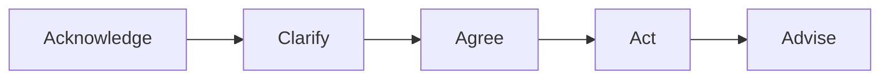

# Kommunikation im IT-Support

## Wozu ist dieses Dokument?

Hier findest du alles zu professioneller Kommunikation im Support: Service-Mindset, Gesprächsstruktur, Deeskalation und bewährte Kommunikationsmodelle. Mit konkreten Dialogbeispielen für typische Situationen.

---

## In 2 Minuten gelesen

- Service-Mindset: Empathie + Klarheit + Verbindlichkeit
- Gesprächsstruktur: Acknowledge → Clarify → Agree → Act → Advise
- Deeskalation: Zuhören, Verständnis zeigen, Lösung anbieten
- GFK (4 Schritte): Beobachtung → Gefühl → Bedürfnis → Bitte
- 4-Ohren-Modell: Jede Nachricht hat 4 Seiten (Sachinhalt, Appell, Beziehung, Selbstoffenbarung)

---

## Service-Mindset: Die 3 Säulen

### 1. Empathie
- Versetze dich in die Lage des Users
- Anerkenne die Frustration, ohne sie zu verstärken
- „Ich verstehe, dass das frustrierend ist"

### 2. Klarheit
- Vermeide IT-Jargon oder erkläre ihn
- Sag klar, was du tust und warum
- Gib realistische Zeitangaben

### 3. Verbindlichkeit
- Halte Zusagen ein
- Wenn es länger dauert: proaktiv informieren
- Schließe jeden Kontakt mit nächstem Schritt ab

---

## Gesprächsstruktur: ACAAA-Framework



### Die 5 Schritte im Detail

| Schritt | Was tun | Beispielsatz |
|---------|---------|--------------|
| **Acknowledge** | Problem annehmen, Verständnis zeigen | „Ich verstehe, das ist ärgerlich. Ich kümmere mich darum." |
| **Clarify** | Rückfragen stellen, Problem verstehen | „Seit wann tritt das auf? Gibt es eine Fehlermeldung?" |
| **Agree** | Erwartungen abstimmen, nächste Schritte klären | „Ich schaue mir das jetzt an. In 30 Minuten melde ich mich." |
| **Act** | Problem bearbeiten, lösen oder eskalieren | [Troubleshooting durchführen] |
| **Advise** | Ergebnis mitteilen, Prävention, Follow-up | „Das Problem ist gelöst. Falls es wieder auftritt, melden Sie sich." |

---

## Deeskalation in 60 Sekunden

Wenn ein User verärgert ist, folge diesem Ablauf:

```
┌─────────────────────────────────────────────────────────────────┐
│ Sekunde 0-20: ZUHÖREN                                           │
│   → Nicht unterbrechen                                          │
│   → Kurze Bestätigungen: „Ja", „Ich verstehe"                   │
├─────────────────────────────────────────────────────────────────┤
│ Sekunde 20-40: VERSTEHEN ZEIGEN                                 │
│   → „Das klingt wirklich frustrierend."                         │
│   → „Ich kann nachvollziehen, dass Sie ärgerlich sind."         │
├─────────────────────────────────────────────────────────────────┤
│ Sekunde 40-60: LÖSUNG ANBIETEN                                  │
│   → „Lassen Sie mich schauen, wie ich Ihnen helfen kann."       │
│   → „Ich kümmere mich sofort darum."                            │
└─────────────────────────────────────────────────────────────────┘
```

### Deeskalations-Phrasen

| Situation | So NICHT | Besser so |
|-----------|----------|-----------|
| User ist sauer | „Beruhigen Sie sich mal." | „Ich verstehe Ihre Frustration." |
| Problem unklar | „Das haben Sie mir nicht gesagt." | „Lassen Sie mich noch mal nachfragen." |
| Kann nicht sofort lösen | „Da kann ich nichts machen." | „Das braucht etwas Zeit. Ich melde mich in X." |
| War nicht mein Fehler | „Das war nicht ich." | „Das tut mir leid. Ich schaue, wie ich helfen kann." |

---

## Kommunikationsmodell 1: Aktives Zuhören

### 3 Komponenten

1. **Paraphrasieren:** Wiederhole das Gehörte in eigenen Worten
   - „Wenn ich Sie richtig verstehe, können Sie seit heute Morgen nicht drucken?"

2. **Gefühle spiegeln:** Benenne die Emotion
   - „Das klingt frustrierend, besonders wenn Sie eine Deadline haben."

3. **Nachfragen:** Zeige echtes Interesse
   - „Können Sie mir mehr dazu sagen? Was haben Sie schon versucht?"

### Wann einsetzen?
- Bei jedem Erstkontakt
- Bei unklaren Anfragen
- Bei emotionalen Usern

---

## Kommunikationsmodell 2: Gewaltfreie Kommunikation (GFK)

Die 4 Schritte nach Marshall Rosenberg:

```
┌──────────────────────────────────────────────────────────────┐
│ 1. BEOBACHTUNG  (Was sehe/höre ich konkret?)                │
│    „Ich sehe, dass Ihre Anfrage seit 3 Tagen offen ist."     │
├──────────────────────────────────────────────────────────────┤
│ 2. GEFÜHL  (Wie fühle ich mich dabei?)                       │
│    „Das ist mir unangenehm."                                 │
├──────────────────────────────────────────────────────────────┤
│ 3. BEDÜRFNIS  (Was brauche ich?)                             │
│    „Mir ist wichtig, dass Sie eine schnelle Lösung bekommen."│
├──────────────────────────────────────────────────────────────┤
│ 4. BITTE  (Konkrete Handlung, die ich mir wünsche)           │
│    „Können wir jetzt gemeinsam das Problem durchgehen?"      │
└──────────────────────────────────────────────────────────────┘
```

### Beispiel: User beschwert sich

**User:** „Nie funktioniert hier irgendwas! Das ist doch eine Zumutung!"

**GFK-Antwort:**
- **Beobachtung:** „Ich höre, dass Sie mehrfach Probleme hatten."
- **Gefühl/Empathie:** „Das ist verständlicherweise frustrierend."
- **Bedürfnis:** „Mir ist wichtig, dass Sie zuverlässig arbeiten können."
- **Bitte:** „Können Sie mir das aktuelle Problem beschreiben, damit ich es lösen kann?"

---

## Kommunikationsmodell 3: Vier-Ohren-Modell (Schulz von Thun)

Jede Nachricht hat 4 Seiten – als Sender und Empfänger:

```
                    SACHINHALT
                    (Worüber informiere ich?)
                         │
    SELBSTOFFENBARUNG ───┼─── APPELL
    (Was sage ich über    │    (Was soll der
     mich selbst?)        │     andere tun?)
                         │
                    BEZIEHUNG
                    (Wie stehe ich zum anderen?)
```

### Beispiel: „Der Drucker geht schon wieder nicht!"

| Ohr | Was könnte gemeint sein? |
|-----|-------------------------|
| **Sachinhalt** | Drucker funktioniert nicht |
| **Appell** | Repariere das! / Hilf mir! |
| **Beziehung** | Ihr (IT) macht euren Job nicht richtig |
| **Selbstoffenbarung** | Ich bin gestresst / unter Druck |

### Praxis-Tipp
Reagiere auf das **Beziehungs-** und **Selbstoffenbarungs-Ohr** bevor du das **Sach-Ohr** bedienst:

- ❌ „Haben Sie schon neu gestartet?" (nur Sach-Ohr)
- ✅ „Das ist ärgerlich, wenn man gerade etwas drucken muss. Ich schaue mir das sofort an." (erst Beziehung, dann Sache)

---

## Erwartungsmanagement & Grenzen setzen

### Erwartungen managen

| Situation | Technik |
|-----------|---------|
| Lösung dauert länger | Zeit-Rahmen geben: „Das braucht ca. 30 Minuten" |
| Kann nicht sofort | Nächsten Schritt nennen: „Ich melde mich bis 14 Uhr" |
| Komplexes Problem | Transparenz: „Das ist ein größeres Problem, ich ziehe einen Kollegen hinzu" |

### Grenzen setzen (professionell)

Manchmal musst du „Nein" sagen – aber konstruktiv:

| So NICHT | Besser so |
|----------|-----------|
| „Das ist nicht mein Job." | „Dafür ist Abteilung X zuständig. Ich verbinde Sie/erstelle ein Ticket." |
| „Das geht nicht." | „Das ist technisch nicht möglich, aber wir könnten alternativ..." |
| „Da kann ich nichts machen." | „Das liegt außerhalb meines Einflussbereichs. Ich eskaliere das für Sie." |

---

## 3 Dialogbeispiele

### Dialog 1: Verärgerter User

**Situation:** User ruft zum dritten Mal wegen desselben Problems an.

```
USER: „Das ist jetzt das dritte Mal, dass ich anrufe! Kann bei euch
       niemand ein Problem richtig lösen?"

SUPPORT: „Ich verstehe Ihre Frustration – dreimal anrufen zu müssen,
          ist wirklich ärgerlich. [ACKNOWLEDGE]

          Lassen Sie mich Ihr Ticket aufrufen und schauen, was bisher
          passiert ist. [CLARIFY]

          Ich sehe hier die letzten beiden Einträge. Tritt das Problem
          immer noch genauso auf wie beim ersten Mal? [CLARIFY]

USER: „Ja, mein Outlook stürzt jeden Morgen ab!"

SUPPORT: „Okay, ich verstehe. Das wurde bisher nur temporär gelöst.
          Ich werde das jetzt eskalieren und sicherstellen, dass wir
          die Ursache finden. [AGREE]

          Ich rufe Sie heute bis 16 Uhr zurück mit einem Update.
          Ist das in Ordnung für Sie?" [AGREE]

USER: „Na gut, aber diesmal will ich eine richtige Lösung."

SUPPORT: „Das verstehe ich. Ich notiere mir, dass es diesmal eine
          dauerhafte Lösung sein muss. Sie hören heute von mir." [ADVISE]
```

---

### Dialog 2: VIP-User / Management

**Situation:** Abteilungsleiter meldet sich, weil sein Team nicht arbeiten kann.

```
USER: „Hier ist Herr Schmidt, Leiter Vertrieb. Mein komplettes Team
       kann nicht auf das CRM zugreifen. Wir haben Kundentelefonate!"

SUPPORT: „Herr Schmidt, das ist kritisch – ich verstehe. Ich kümmere
          mich sofort darum. [ACKNOWLEDGE]

          Betrifft das alle 12 Mitarbeiter im Vertrieb? Und seit wann
          genau? [CLARIFY]

USER: „Seit etwa 10 Minuten. Alle 12 haben das gleiche Problem."

SUPPORT: „Verstanden. Das klingt nach einem serverweiten Problem,
          nicht nach einzelnen Clients. Ich prüfe sofort den
          CRM-Server und melde mich in 10 Minuten bei Ihnen –
          oder früher, wenn ich etwas habe. [AGREE]

          Soll ich Sie direkt zurückrufen oder eine Mail an Sie und
          Ihr Team schicken?"

USER: „Rufen Sie mich an, [Nummer]."

SUPPORT: „Notiert. In spätestens 10 Minuten hören Sie von mir." [ADVISE]
```

---

### Dialog 3: Unklare Anforderung

**Situation:** User weiß nicht genau, was er braucht.

```
USER: „Ich bräuchte mal irgendwie Zugriff auf die Daten von der
       Buchhaltung."

SUPPORT: „Okay, da helfe ich gerne. Können Sie mir etwas mehr erzählen?
          [CLARIFY]

          Um welche Daten geht es genau – sind das Berichte, einzelne
          Dateien, oder ein bestimmtes System?"

USER: „Hmm, keine Ahnung. Mein Chef meinte, ich soll die Zahlen für
       die Auswertung holen."

SUPPORT: „Verstehe. Das klingt nach den Monatsberichten. Die liegen
          normalerweise auf dem Share \\server\buchhaltung. [CLARIFY]

          Haben Sie schon versucht, darauf zuzugreifen?"

USER: „Ja, da steht 'Zugriff verweigert'."

SUPPORT: „Okay, dann fehlt Ihnen die Berechtigung. Die kann ich
          nicht selbst vergeben – das muss Ihr Vorgesetzter bei der
          Buchhaltungsleitung anfragen. [AGREE]

          Ich kann aber ein Ticket erstellen und die Anfrage für Sie
          einleiten. Soll ich das machen?" [AGREE]

USER: „Ja, das wäre super."

SUPPORT: „Erledigt. Die Buchhaltung bekommt die Anfrage, und Sie
          erhalten eine Bestätigung per Mail. Das dauert
          erfahrungsgemäß 1-2 Arbeitstage." [ADVISE]
```

---

## Kommunikation per Videokonferenz (Online-Support)

Im Online-Support per Video gelten besondere Regeln:

### Webcam & Blickkontakt

| Aspekt | Empfehlung |
|--------|------------|
| **Blickkontakt** | In die Kamera schauen = Blickkontakt mit dem User |
| **Kameraposition** | Auf Augenhöhe, nicht von unten oder oben |
| **Hintergrund** | Aufgeräumt, neutral, keine Ablenkung |
| **Beleuchtung** | Licht von vorne, nicht von hinten (kein Fenster im Rücken) |

### Stimme & Sprache

- **Deutlicher sprechen** – Mikrofone komprimieren, nuscheln fällt stärker auf
- **Pausen machen** – Verzögerungen durch Technik einplanen
- **Nachfragen** – „Können Sie mich gut hören und sehen?"
- **Langsamer sprechen** – Online wirkt schnelles Reden hektisch

### Bildschirmfreigabe

| Situation | Best Practice |
|-----------|--------------|
| **Problem zeigen** | User teilt Bildschirm, Support schaut zu |
| **Lösung demonstrieren** | Support teilt Bildschirm und erklärt Schritte |
| **Sensible Daten** | Vorher fragen: „Darf ich Ihren Bildschirm sehen?" |
| **Kontrolle übernehmen** | Nur mit ausdrücklicher Erlaubnis (Remote Control) |

### Typische Online-Probleme

| Problem | Reaktion |
|---------|----------|
| Audio-Probleme | „Ihr Ton ist leise/bricht ab. Können Sie das Mikro näher nehmen?" |
| Video hängt | „Ihr Bild steht. Ich verstehe Sie aber noch. Bitte weitersprechen." |
| Verbindung abbricht | Vorher Telefonnummer austauschen als Backup |

### Professionalität im Videocall

- Kamera an (außer bei technischen Problemen)
- Mikro stumm, wenn nicht sprechend (bei Gruppencalls)
- Keine parallelen Tätigkeiten (Tippen, andere Fenster)
- Pünktlich im Meeting sein

---

## Kommunikations-Checkliste für jeden Kontakt

### Allgemein
```
[ ] User ausreden lassen
[ ] Problem in eigenen Worten wiederholt (Paraphrasieren)
[ ] Bei Emotion: erst Verständnis, dann Sachebene
[ ] Nächsten Schritt genannt
[ ] Zeitrahmen gegeben (wenn möglich)
[ ] Ticket/Dokumentation aktualisiert
```

### Online / Videokonferenz
```
[ ] Kamera an, Blick in die Kamera
[ ] Ton und Bild beim User funktioniert?
[ ] Bildschirmfreigabe vorbereitet?
[ ] Backup-Kontaktmöglichkeit (Telefon) ausgetauscht?
[ ] Deutlich und langsam gesprochen?
```

---

## Quellen (Kurz)

- Marshall Rosenberg: Gewaltfreie Kommunikation – 4-Schritte-Modell
- Friedemann Schulz von Thun: Miteinander reden – 4-Ohren-Modell
- [IT Process Wiki: Incident Management](https://wiki.en.it-processmaps.com/index.php/Incident_Management) – Kommunikation bei Incidents
- [ManageEngine: IT Incident Management](https://www.manageengine.com/products/service-desk/it-incident-management/what-is-it-incident-management.html) – Kundenorientierung im Support
- [IHK Bewertungskriterien](https://www.ihk.de/blueprint/servlet/resource/blob/2618244/21345f4e591a4a035d4e1ca68c3c011f/kriterien-bewertung-praesentation-data.pdf) – Kommunikative Kompetenz als Bewertungskriterium
