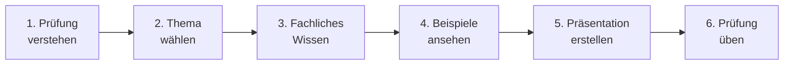

# IT Support Specialist (IHK)

Dieser Leitfaden bereitet dich Schritt für Schritt auf die IHK-Zertifikatsprüfung vor. Arbeite die sechs Bereiche in der vorgegebenen Reihenfolge durch.

---

## Dein Weg zur Prüfung

---

## Die Prüfung auf einen Blick

| Bestandteil | Dauer |
|-------------|-------|
| Präsentation | 10 Minuten |
| Fachgespräch | 5 Minuten |

Die Prüfung findet online per Videokonferenz statt.

---

## Schritt 1: Die Prüfung verstehen

Bevor du beginnst, musst du wissen, was von dir erwartet wird.

- [x] **[Prüfungsablauf](grundlagen/pruefungsleitfaden.md):** Was passiert wann? Von der Themenwahl bis zum Prüfungstag.
- [x] **[Bewertungskriterien](grundlagen/vorgaben-bewertung.md):** Worauf achten die Prüfer?

---

## Schritt 2: Thema wählen

Wähle ein Thema aus deiner echten Praxis. Keine erfundenen Szenarien.

- [x] **[Themenpool](vorbereitung/themenpool.md):** 28 Themenideen mit Tipps zur richtigen Eingrenzung.

---

## Schritt 3: Fachliches Wissen auffrischen

Das Fachgespräch prüft dein Verständnis. Hier sind die wichtigsten Themen.

- [x] **[Fehleranalyse](vorbereitung/troubleshooting.md):** Systematische Problemlösung zeigen.
- [x] **[Kundenkommunikation](vorbereitung/kommunikation.md):** Professionell mit Anwendern sprechen.

---

## Schritt 4: Von Beispielen lernen

Schau dir an, wie eine gute Präsentation aussehen kann.

| Beispiel | Schwerpunkt |
|----------|-------------|
| [DNS-Problem lösen](beispiele/technik-dns.md) | Technische Fehleranalyse |
| [Client-Rollout](beispiele/technik-rollout.md) | Strukturiertes Vorgehen |
| [Eskalation bewältigen](beispiele/kommunikation-recovery.md) | Kommunikation und Deeskalation |
| [Zugangsproblem](beispiele/mix-identity.md) | Technik und Kommunikation kombiniert |

---

## Schritt 5: Präsentation erstellen

Baue deine Präsentation nach einem bewährten Schema auf.

- [x] **[Folienaufbau](vorbereitung/praesentationsblueprint.md):** 8 Folien für 10 Minuten – mit Zeitplan.
- [x] **[Formulierungshilfen](vorbereitung/merksatzkarten.md):** Sätze, die immer funktionieren.

---

## Schritt 6: Prüfung üben

Übe mit echten Fragen und simuliere die Prüfungssituation.

- [x] **[Fragen und Antworten](pruefung/fragenkatalog.md):** Über 55 typische Prüferfragen.
- [x] **[Probeprüfung](pruefung/mock-pruefung.md):** So übst du unter realistischen Bedingungen.
- [x] **[Checkliste Prüfungstag](pruefung/checkliste.md):** Technik, Raum, Ablauf.

---

## Die fünf goldenen Regeln

| Regel | Beschreibung |
|-------|--------------|
| **Zielgruppe nennen** | Sag zu Beginn, für wen du präsentierst (nicht „Prüfungsausschuss") |
| **Struktur zeigen** | Problem → Vorgehen → Ergebnis |
| **Entscheidungen begründen** | Erkläre, warum du dich für eine Lösung entschieden hast |
| **Ergebnis mit Nutzen zeigen** | Was hat es gebracht? |
| **Zeit einhalten** | 10 Minuten bedeutet 10 Minuten |

---

## Zeitplan bis zur Prüfung

| Zeitpunkt | Aufgabe | Leitfaden-Abschnitt |
|-----------|---------|---------------------|
| 3 Wochen vorher | Thema wählen und eingrenzen | Schritt 1 + 2 |
| 2 Wochen vorher | Fachliches auffrischen, Beispiele ansehen | Schritt 3 + 4 |
| 1 Woche vorher | Präsentation erstellen, Fragen üben | Schritt 5 + 6 |
| 5 Tage vorher | Erste Generalprobe | – |
| 3 Tage vorher | Zweite Generalprobe mit Feedback | – |
| 1 Tag vorher | Technik testen, früh schlafen | Checkliste |
| Prüfungstag | 15-20 Minuten früher einwählen | – |

---

## Nachschlagewerk

Das **[Glossar](glossar.md)** enthält alle wichtigen Fachbegriffe, die du für die Prüfung kennen musst. Nutze es als Nachschlagewerk während deiner Vorbereitung.
