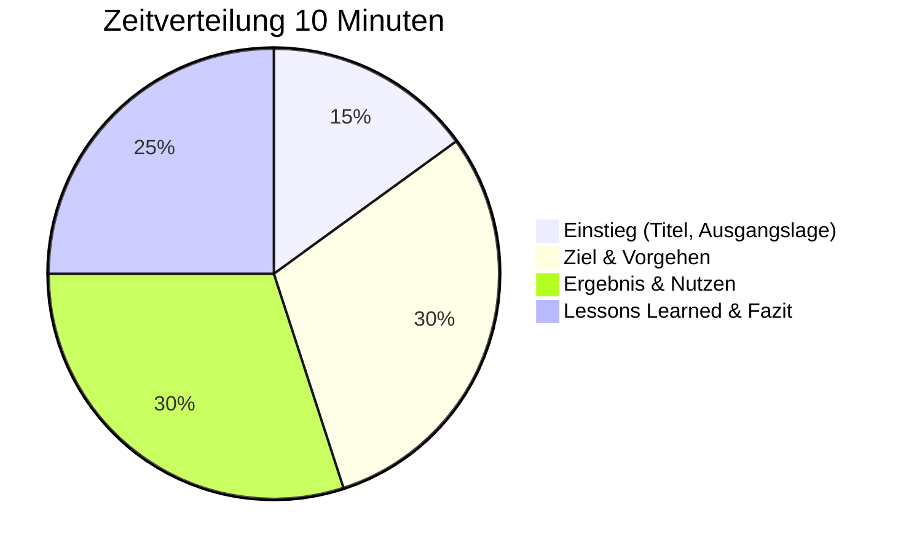

# Folienaufbau

Hier findest du den Standard-Folienplan für deine 10-Minuten-Präsentation. Drei Varianten (Technik, Kommunikation, Mix) und eine Checkliste für die finale Prüfung deiner Folien.

---

## Das Wichtigste

- **7-9 Folien** sind optimal für 10 Minuten
- Pro Folie: **1-1,5 Minuten** Redezeit
- Zielgruppe auf Folie 1 nennen (oder mündlich vor Start)
- Ergebnis mit Nutzen muss auf jeden Fall rein
- Keine Textwände – Schlagworte und Visuals nutzen
- **Online-Prüfung:** Bildschirmfreigabe vorbereiten, Folien gut lesbar gestalten

---

## Standard-Folienplan (8 Folien)

| Folie | Titel | Zeit | Inhalt |
|-------|-------|------|--------|
| 1 | Titel + Zielgruppe | 0:30 | Thema, dein Name, Zielgruppe nennen |
| 2 | Ausgangslage | 1:00 | Problem, Impact, wer war betroffen |
| 3 | Ziel & Scope | 1:00 | Was wollte ich erreichen? Abgrenzung |
| 4 | Vorgehen (Teil 1) | 1:30 | Analyse, erste Schritte, Hypothesen |
| 5 | Vorgehen (Teil 2) | 1:30 | Durchführung, Entscheidungen |
| 6 | Ergebnis | 1:30 | Was wurde erreicht? Nachweis, Nutzen |
| 7 | Lessons Learned | 1:30 | Was würde ich anders machen? Risiken |
| 8 | Zusammenfassung | 1:00 | Kernaussagen, Ausblick, Dank |
| | **Gesamt** | **10:00** | |

---

## Variante A: Technik-Fokus

Für technische Troubleshooting-Cases (DNS, Client-Problem, Security-Incident).

| Folie | Zeit | Inhalt | Artefakt |
|-------|------|--------|----------|
| **1. Titel + Zielgruppe** | 0:30 | Name, Thema, „Meine Zielgruppe sind IT-Administratoren" | – |
| **2. Incident-Beschreibung** | 1:00 | Was war das Problem? Symptome, Impact, Dringlichkeit | Ticket-Auszug, Fehlermeldung |
| **3. Analyse-Ansatz** | 1:00 | Welche Hypothesen? Welche Diagnoseschritte? | Diagnose-Workflow, OSI-Layer |
| **4. Troubleshooting** | 1:30 | Konkrete Schritte, Tools, Befehle | Log-Auszug, Ping/nslookup |
| **5. Root Cause + Lösung** | 1:30 | Ursache gefunden, Entscheidung begründet | Konfiguration, Fix-Nachweis |
| **6. Ergebnis + Validierung** | 1:30 | Problem gelöst, Vorher/Nachher | Erfolgstest, Ticket-Abschluss |
| **7. Dokumentation + Prävention** | 1:00 | Was dokumentiert? Wiederholung verhindern? | KB-Eintrag, Monitoring-Alert |
| **8. Fazit + Q&A** | 1:00 | Kernaussagen, „Ich freue mich auf Ihre Fragen" | – |

---

## Variante B: Kommunikation-Fokus

Für Cases mit Schwerpunkt Kundenkommunikation, Eskalation, Service Recovery.

| Folie | Zeit | Inhalt | Artefakt |
|-------|------|--------|----------|
| **1. Titel + Zielgruppe** | 0:30 | „Meine Zielgruppe ist das Service-Management" | – |
| **2. Ausgangssituation** | 1:00 | Was war passiert? Wer betroffen? Emotionslage? | Anonymisierte Beschwerde, Eskalationsmail |
| **3. Herausforderung** | 1:00 | Was machte den Fall schwierig? Zeitdruck, VIP? | Timeline, Stakeholder-Übersicht |
| **4. Kommunikationsstrategie** | 1:30 | Gesprächsstruktur, Deeskalation | Gesprächsleitfaden, Kommunikationsmodell |
| **5. Umsetzung** | 1:30 | Konkrete Gespräche, Maßnahmen, Abstimmungen | Protokollauszug, Maßnahmenplan |
| **6. Ergebnis** | 1:30 | Situation entschärft, Beziehung stabilisiert | Feedback, Follow-up-Status |
| **7. Lessons Learned** | 1:00 | Was gelernt? Was anders machen? | Prozessverbesserung, Eskalationsmatrix |
| **8. Fazit + Q&A** | 1:00 | Kernaussagen zur Servicekommunikation | – |

---

## Variante C: Mix-Fokus (empfohlen)

Für Cases, die technische Kompetenz und Kommunikation verbinden.

| Folie | Zeit | Inhalt | Artefakt |
|-------|------|--------|----------|
| **1. Titel + Zielgruppe** | 0:30 | „Meine Zielgruppe ist die IT-Leitung" | – |
| **2. Ausgangslage** | 1:00 | Technisches Problem + betroffene User + Business Impact | Ticket mit Impact |
| **3. Ziel + Scope** | 0:45 | Technisches Ziel + Kommunikationsziel | Erfolgskriterien-Liste |
| **4. Technische Analyse** | 1:30 | Diagnose, Hypothesen, Troubleshooting-Schritte | Diagnose-Output, Log-Auszug |
| **5. User-Kommunikation** | 1:15 | Wie User informiert? Erwartungsmanagement | Kommunikationsbeispiel, Status-Update |
| **6. Lösung + Entscheidung** | 1:30 | Lösung implementiert, Option A vs. B begründet | Konfiguration, Entscheidungsmatrix |
| **7. Ergebnis** | 1:30 | Technisch gelöst + User zufrieden + Dokumentiert | Erfolgsnachweise, Feedback |
| **8. Fazit + Lessons Learned** | 1:00 | Zusammenfassung, Prävention, Ausblick | – |

---

## Zeitverteilung

---

## Checkliste: Folien prüfen

### Timing

- [ ] Generalprobe mit Stoppuhr gemacht?
- [ ] **Online-Generalprobe:** Mit Bildschirmfreigabe geübt?
- [ ] Jede Folie in 1-1,5 Minuten besprechbar?
- [ ] Puffer für Versprecher eingeplant?

### Story & Struktur

- [ ] Zielgruppe genannt (Folie 1 oder mündlich)?
- [ ] Problem → Vorgehen → Ergebnis erkennbar?
- [ ] Roter Faden durchgängig?
- [ ] Keine inhaltlichen Sprünge?

### Visuals (wichtig für Online-Präsentation!)

- [ ] Keine Textwände (max. 6 Bulletpoints pro Folie)?
- [ ] Schriftgröße lesbar (mind. 24pt – bei Bildschirmfreigabe wirkt alles kleiner!)
- [ ] Mindestens 1 Diagramm/Screenshot?
- [ ] Farben kontrastreich (Kompression bei Video kann Kontraste reduzieren)?
- [ ] Folien im 16:9-Format (passt besser für Bildschirmfreigabe)?

### Begriffe & Tiefe

- [ ] Fachbegriffe verwendet, die du erklären kannst?
- [ ] Mindestens 1 Entscheidung begründet?
- [ ] Mindestens 1 Alternative genannt?

### Ergebnissicherung

- [ ] Messbares Ergebnis auf Folie?
- [ ] Nutzen für Zielgruppe klar?
- [ ] Dokumentation/Follow-up erwähnt?

---

## Artefakte: Was zeigen?

| Artefakt-Typ | Beispiele | Hinweis |
|--------------|-----------|---------|
| **Screenshot** | Ticket, Fehlermeldung, Tool-Output | Persönliche Daten schwärzen |
| **Log-Auszug** | Event-Log, Command-Output | Nur relevante Zeilen, formatiert |
| **Diagramm** | Workflow, Netzwerkskizze, Timeline | Selbst erstellt oder aus Tool |
| **Tabelle** | Entscheidungsmatrix, Vergleich | Übersichtlich halten |
| **Konfiguration** | GPO, Policy, Skript-Auszug | Kommentiert, nicht zu lang |

!!! warning "Wichtig"
    Artefakte unterstützen deine Story – sie ersetzen sie nicht. Zeige sie kurz und erkläre, was man sieht.

!!! tip "Online-Tipp"
    Bei Bildschirmfreigabe können Details schwer erkennbar sein. Vergrößere wichtige Bereiche in Screenshots oder markiere sie farbig. Teste die Lesbarkeit vorher in einer Probe-Videokonferenz!

