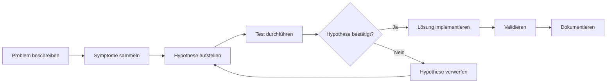

# Fehleranalyse

Hier findest du Methoden für systematische Fehleranalyse. Damit zeigst du in der Präsentation und im Fachgespräch, dass du strukturiert arbeitest.

---

## Das Wichtigste

- Troubleshooting ist **kein Raten** – es folgt einem System
- **Hypothese → Test → Ergebnis → Nächster Schritt**
- OSI-Modell hilft bei Netzwerkproblemen (unten anfangen)
- Ticket-Triage: **Impact × Urgency = Priority**
- Dokumentiere alles: Repro, Logs, Fix, Prävention

---

## Methode 1: Hypothesenbasiertes Troubleshooting

Das hypothesenbasierte Troubleshooting ist die wichtigste Methode im IT-Support. Anstatt wahllos Dinge auszuprobieren, gehst du wissenschaftlich vor: Du stellst eine Vermutung auf, testest sie gezielt und ziehst Schlüsse aus dem Ergebnis.

**Warum ist das wichtig?** Prüfer wollen sehen, dass du strukturiert denkst. „Ich habe einfach mal neu gestartet" ist keine gute Antwort. Besser: „Meine Hypothese war, dass ein Dienst nicht läuft. Ich habe das mit `Get-Service` geprüft und festgestellt, dass..."

**Der Ablauf im Detail:**

1. **Problem beschreiben:** Formuliere das Problem präzise. „Computer geht nicht" ist zu vage. „User kann sich nicht anmelden, Fehlermeldung ‚Falsches Passwort'" ist besser.

2. **Symptome sammeln:** Was siehst du? Fehlermeldungen, Verhalten, Zeitpunkt des Auftretens. Je mehr Informationen, desto besser deine Hypothese.

3. **Hypothese aufstellen:** Basierend auf den Symptomen: Was könnte die Ursache sein? Beginne mit der wahrscheinlichsten.

4. **Test durchführen:** Prüfe deine Hypothese mit einem gezielten Test. Der Test muss die Hypothese bestätigen oder widerlegen können.

5. **Auswerten:** Hat der Test die Hypothese bestätigt? Wenn ja, löse das Problem. Wenn nein, stelle eine neue Hypothese auf.

### So wendest du es an:

| Schritt | Frage | Beispiel |
|---------|-------|----------|
| 1. Problem | Was genau funktioniert nicht? | „User kann E-Mails nicht senden" |
| 2. Symptome | Was sehe/höre ich? Fehlermeldung? | „Timeout-Fehler nach 30 Sekunden" |
| 3. Hypothese | Was könnte die Ursache sein? | „Mailserver nicht erreichbar" |
| 4. Test | Wie prüfe ich das? | Ping, Telnet Port 25, nslookup MX |
| 5. Ergebnis | Was sagt der Test? | „Ping funktioniert, Port 25 blockiert" |
| 6. Nächster Schritt | Lösung oder neue Hypothese? | „Firewall-Regel prüfen" |

---

## Methode 2: Teile und Herrsche

Die „Teile und Herrsche"-Methode (auch: Divide and Conquer) ist besonders effektiv bei komplexen Systemen mit vielen Komponenten. Das Prinzip: Du teilst das Gesamtsystem in einzelne Bereiche und testest systematisch, welcher Bereich das Problem verursacht.

**Wann nutzt du diese Methode?** Wenn du nicht weißt, wo das Problem liegt. Statt jeden einzelnen Punkt zu testen, halbierst du das System und prüfst: Funktioniert die erste Hälfte? Wenn ja, liegt das Problem in der zweiten Hälfte. So grenzt du schnell ein.

**Beispiel:** Ein User kann nicht auf einen Server zugreifen. Das System besteht aus: Client → Netzwerk → Server → Dienst. Statt alles einzeln zu prüfen, testest du zuerst das Netzwerk (Mitte). Funktioniert der Ping zum Server? Wenn ja, ist das Netzwerk OK – das Problem liegt beim Dienst. Wenn nein, prüfst du Client und Netzwerk genauer.

Teile das System in Komponenten und isoliere das Problem:

**Schritt 1:** Status erfassen

| Client | Netzwerk | Server | Dienst |
|--------|----------|--------|--------|
| OK | ? Unklar | ? Unklar | ? Unklar |

**Schritt 2:** Netzwerk testen (Ergebnis: OK)

| Client | Netzwerk | Server | Dienst |
|--------|----------|--------|--------|
| OK | OK | ? Unklar | ? Unklar |

**Schritt 3:** Server testen, dann Dienst eingrenzen

!!! tip "Prinzip"
    Halbiere das System, teste die Mitte, grenze ein.

---

## OSI-Modell für Netzwerk-Fehlersuche

Das OSI-Modell (Open Systems Interconnection) ist ein Referenzmodell, das Netzwerkkommunikation in sieben Schichten unterteilt. Für das Troubleshooting ist es unverzichtbar, weil es dir hilft, Probleme systematisch einzugrenzen.

**Die goldene Regel:** Beginne immer bei Layer 1 (physisch) und arbeite dich nach oben. Warum? Weil ein Problem auf einer unteren Schicht alle darüberliegenden Schichten beeinflusst. Wenn das Kabel nicht steckt (Layer 1), bringt es nichts, DNS-Einstellungen zu prüfen (Layer 7).

**Warum ist das OSI-Modell prüfungsrelevant?** Prüfer fragen gerne: „Wie sind Sie bei der Fehlersuche vorgegangen?" Eine Antwort wie „Ich habe systematisch nach dem OSI-Modell gearbeitet, beginnend bei Layer 1" zeigt strukturiertes Denken.

**Die wichtigsten Layer für den IT-Support:**

- **Layer 1 (Physical):** Kabel, Stecker, LEDs, Hardware. Erste Prüfung: Ist alles physisch verbunden?
- **Layer 2 (Data Link):** MAC-Adressen, Switches, VLANs. Hier geht es um die direkte Verbindung im lokalen Netzwerk.
- **Layer 3 (Network):** IP-Adressen, Routing, Firewalls. Die meisten Netzwerkprobleme liegen hier.
- **Layer 4 (Transport):** Ports, TCP/UDP. Wichtig für Anwendungsverbindungen.
- **Layer 5-7 (Application):** Dienste, Authentifizierung, Anwendungslogik.

Beginne bei Layer 1 (physisch) und arbeite dich nach oben:

| Layer | Name | Typische Prüfungen | Tools/Befehle |
|-------|------|-------------------|---------------|
| 1 | Physical | Kabel, LEDs, Verbindung | Sichtprüfung, Kabeltester |
| 2 | Data Link | MAC, Switch-Port, VLAN | `arp -a`, Switch-Config |
| 3 | Network | IP, Routing, Firewall | `ping`, `tracert`, `ipconfig` |
| 4 | Transport | Ports, TCP/UDP | `netstat`, `telnet`, `Test-NetConnection` |
| 5-7 | Application | Dienst, Authentifizierung | Service-Status, Logs |

### Typischer Ablauf bei „Kein Netzwerk"

| Schritt | Prüfung | Layer |
|---------|---------|-------|
| 1 | Kabel drin? LED an? | Layer 1 |
| 2 | IP-Adresse vorhanden? DHCP OK? | Layer 3 |
| 3 | Gateway erreichbar? (ping) | Layer 3 |
| 4 | DNS funktioniert? (nslookup) | Layer 7 |
| 5 | Zielserver erreichbar? (ping hostname) | Layer 3 |
| 6 | Dienst auf Zielport erreichbar? | Layer 4 |

---

## Ursachenanalyse

Die Ursachenanalyse (Root Cause Analysis) geht über das reine Troubleshooting hinaus. Während Troubleshooting das Symptom behebt, sucht die Ursachenanalyse nach dem eigentlichen Grund – um Wiederholungen zu verhindern.

**Warum ist das wichtig?** Im IT-Support löst du oft das gleiche Problem mehrfach. Eine Ursachenanalyse hilft dir, den wahren Grund zu finden und das Problem dauerhaft zu beheben. Prüfer schätzen es, wenn du nicht nur „das Problem gelöst" hast, sondern auch „die Wiederholung verhindert" hast.

**Der Unterschied:**

- **Symptom:** User kann nicht drucken → **Sofortlösung:** Drucker neu starten
- **Root Cause:** Drucker hat keine feste IP → **Dauerhafte Lösung:** DHCP-Reservierung einrichten

### Methode 1: 5-Why

Die 5-Why-Methode ist einfach aber effektiv: Du fragst fünfmal „Warum?", bis du zur eigentlichen Ursache kommst. Die Zahl 5 ist dabei ein Richtwert – manchmal reichen 3 Fragen, manchmal brauchst du 7.

**So funktioniert es:** Jede Antwort wird zur nächsten Frage. Du bohrst immer tiefer, bis du auf etwas stößt, das du ändern kannst – typischerweise einen fehlenden Prozess, eine falsche Konfiguration oder ein Wissenslücke.

Frage 5x „Warum?", um zur Ursache zu kommen:

| Iteration | Frage | Antwort |
|-----------|-------|---------|
| 1 | Warum konnte der User nicht drucken? | Drucker war offline |
| 2 | Warum war der Drucker offline? | IP-Adresse hatte sich geändert |
| 3 | Warum hatte sich die IP geändert? | DHCP-Lease war abgelaufen |
| 4 | Warum gab es keine Reservierung? | Drucker war nicht im DHCP reserviert |
| 5 | Warum war er nicht reserviert? | Kein Prozess für Drucker-Onboarding |

!!! success "Root Cause"
    Fehlender Prozess → **Maßnahme:** DHCP-Reservierung für alle Drucker

### Methode 2: Known Good Comparison

Die Known-Good-Comparison-Methode ist besonders hilfreich, wenn du keine Ahnung hast, was falsch sein könnte. Das Prinzip: Vergleiche das fehlerhafte System Punkt für Punkt mit einem funktionierenden System. Der Unterschied zeigt dir oft das Problem.

**Wann nutzt du diese Methode?**

- Wenn ein System plötzlich nicht mehr funktioniert, ohne dass du etwas geändert hast
- Wenn nur ein einzelner Rechner betroffen ist, aber andere funktionieren
- Wenn du keine Fehlermeldung hast und im Dunkeln tappst

**Typische Vergleichspunkte:** IP-Konfiguration, DNS-Server, Gateway, Gruppenmitgliedschaften, installierte Software, Gruppenrichtlinien.

Vergleiche das fehlerhafte System mit einem funktionierenden:

| Aspekt | Defektes System | Funktionierendes System | Unterschied? |
|--------|-----------------|------------------------|--------------|
| IP-Adresse | 192.168.1.150 | 192.168.1.100 | Anderes Subnet? Nein |
| DNS-Server | 192.168.1.1 | 192.168.1.10 | **Ja – falscher DNS!** |
| Gateway | 192.168.1.1 | 192.168.1.1 | Nein |

### Methode 3: Ishikawa (Fischgräte) – vereinfacht

Das Ishikawa-Diagramm (auch Fischgräten-Diagramm oder Ursache-Wirkungs-Diagramm) hilft bei komplexen Problemen, bei denen viele verschiedene Faktoren eine Rolle spielen könnten. Du kategorisierst mögliche Ursachen in Gruppen und gehst sie systematisch durch.

**Die klassischen Kategorien (4M):**

- **Mensch:** Bedienfehler, fehlendes Wissen, falsche Berechtigungen
- **Maschine:** Hardware-Defekte, Software-Fehler, Konfigurationsprobleme
- **Methode:** Falsche Prozesse, fehlende Dokumentation, unklare Abläufe
- **Material:** Fehlende Dateien, korrupte Daten, falsche Versionen

**Wann nutzt du diese Methode?** Bei wiederkehrenden oder komplexen Problemen, bei denen eine einzelne Ursache nicht offensichtlich ist. Auch gut für Team-Analysen nach einem Major Incident.

Für komplexere Probleme mit mehreren möglichen Ursachen:

| Kategorie | Mögliche Ursachen |
|-----------|-------------------|
| **Mensch** | Falsches Passwort? Fehlende Berechtigungen? |
| **Maschine** | Server down? Netzwerk-Problem? |
| **Methode** | Falscher Pfad? Vererbung falsch? |
| **Material** | Dateien gelöscht? Verschlüsselt? |

**Beispiel-Problem:** User kann nicht auf Share zugreifen

---

## Ticket-Priorisierung

Im IT-Support kommen ständig neue Anfragen rein. Die Kunst ist, die richtigen Prioritäten zu setzen. Nicht jedes Problem ist gleich dringend – und nicht jeder, der am lautesten ruft, hat das wichtigste Problem.

**Das ITIL-Konzept:** Die Priorität eines Tickets ergibt sich aus zwei Faktoren:

- **Impact (Auswirkung):** Wie viele User oder Systeme sind betroffen? Ein Mailserver-Ausfall für 500 User ist schlimmer als ein Druckerproblem für einen User.
- **Urgency (Dringlichkeit):** Wie schnell muss das Problem gelöst werden? Gibt es einen Workaround? Steht eine Deadline bevor?

**Die Formel:** Impact × Urgency = Priority

**Warum ist das prüfungsrelevant?** Prüfer fragen oft: „Wie haben Sie das Problem priorisiert?" oder „Warum haben Sie dieses Ticket zuerst bearbeitet?" Mit dem Impact-Urgency-Modell kannst du deine Entscheidung nachvollziehbar begründen.

### Definitionen

| Begriff | Bedeutung | Beispiel |
|---------|-----------|----------|
| **Impact** | Wie viele User/Systeme betroffen? | 1 User, Team, Abteilung, Firma |
| **Urgency** | Wie dringend ist eine Lösung? | Workaround möglich? Deadline? |
| **Priority** | Reihenfolge der Bearbeitung | P1 (kritisch) bis P4 (gering) |

### Priority-Matrix

|  | **Urgency: Hoch** | **Urgency: Mittel** | **Urgency: Niedrig** |
|--|-------------------|---------------------|----------------------|
| **Impact: Hoch** | P1 – Kritisch | P2 – Hoch | P3 – Mittel |
| **Impact: Mittel** | P2 – Hoch | P3 – Mittel | P4 – Gering |
| **Impact: Niedrig** | P3 – Mittel | P4 – Gering | P4 – Gering |

### Typische Reaktionszeiten (Beispiel)

| Priority | Erste Reaktion | Ziel-Lösung |
|----------|---------------|-------------|
| P1 | 15 Minuten | 4 Stunden |
| P2 | 1 Stunde | 8 Stunden |
| P3 | 4 Stunden | 24 Stunden |
| P4 | 8 Stunden | 72 Stunden |

---

## Eskalation: Wann und wie?

Eskalation ist kein Zeichen von Schwäche – es ist ein professionelles Werkzeug. Im IT-Support wirst du regelmäßig auf Probleme stoßen, die du nicht allein lösen kannst. Zu wissen, wann und wie du eskalierst, ist eine Kernkompetenz.

**Wichtig:** Eskalation bedeutet nicht „das Problem abgeben". Du übergibst strukturiert an jemanden, der besser helfen kann – mit allen relevanten Informationen.

### Funktionale Eskalation (Fachlich)

Die funktionale Eskalation geht an Spezialisten mit mehr Know-how. Du bleibst am Ticket, holst dir aber Expertenwissen.

**Typische Szenarien:**

- Du hast ein Netzwerkproblem identifiziert, aber keine Berechtigung für die Firewall
- Das Problem liegt im ERP-System, du kennst dich aber nur mit der Infrastruktur aus
- Du brauchst Zugriff auf Systeme, die nur der 2nd Level hat

**So eskalierst du richtig:** Dokumentiere, was du bereits geprüft hast. Niemand will bei null anfangen.

### Hierarchische Eskalation (Management)

Die hierarchische Eskalation geht an Vorgesetzte. Hier geht es nicht um technisches Know-how, sondern um Entscheidungen und Ressourcen.

**Typische Szenarien:**

- Ein SLA droht verletzt zu werden
- Du brauchst Budget oder zusätzliche Ressourcen
- Es gibt einen Konflikt mit einem anderen Team oder Kunden
- Eine politische oder strategische Entscheidung ist nötig

### Eskalations-Checkliste

- [ ] Problem klar dokumentiert (was, wann, wer betroffen)
- [ ] Bisherige Maßnahmen aufgelistet
- [ ] Impact und Dringlichkeit bewertet
- [ ] Erwartung an Eskalationsziel formuliert
- [ ] Übergabe an nächste Ebene sauber dokumentiert

---

## Dokumentation: Was muss ins Ticket?

Gute Dokumentation unterscheidet professionellen IT-Support von „irgendwie hinbiegen". Sie hat drei wichtige Funktionen:

1. **Nachvollziehbarkeit:** Wenn das Problem wieder auftritt, kann jeder (auch du selbst in 6 Monaten) verstehen, was getan wurde.
2. **Wissenstransfer:** Kollegen können von deinen Lösungen lernen.
3. **Rechtliche Absicherung:** Bei Streitigkeiten oder Audits ist dokumentiert, was wann passiert ist.

**Prüfungsrelevanz:** „Wie haben Sie das dokumentiert?" ist eine typische Prüferfrage. Eine gute Antwort zeigt, dass du professionell arbeitest.

**Die goldene Regel:** Dokumentiere so, dass ein Kollege das Ticket verstehen und weiterbearbeiten kann, ohne dich fragen zu müssen.

### Minimum-Standard

| Feld | Inhalt |
|------|--------|
| **Symptom** | Was genau funktioniert nicht? |
| **Reproduktion** | Wie kann man das Problem nachstellen? |
| **Betroffene** | User, Systeme, Standort |
| **Diagnose** | Was wurde geprüft? Ergebnisse? |
| **Root Cause** | Was war die Ursache? |
| **Fix** | Was wurde gemacht? |
| **Validierung** | Wie wurde geprüft, dass es funktioniert? |
| **Prävention** | Was verhindert Wiederholung? |

### Beispiel-Dokumentation

| Feld | Dokumentation |
|------|---------------|
| **Symptom** | User Müller kann nicht auf \\\\server\\share zugreifen |
| **Repro** | Zugriff über Explorer, Fehlermeldung „Zugriff verweigert" |
| **Betroffene** | 1 User, Buchhaltung |
| **Diagnose** | NTFS-Rechte geprüft: User nicht in Gruppe. Share-Rechte OK. Konto nicht gesperrt. |
| **Root Cause** | User fehlte in AD-Gruppe „Buchhaltung" |
| **Fix** | User zur AD-Gruppe hinzugefügt, gpupdate /force |
| **Validierung** | User kann jetzt auf Share zugreifen |
| **Prävention** | Onboarding-Checkliste um Gruppenzuweisung ergänzt |

---

## Wichtige Befehle und Tools

Als IT-Supporter brauchst du ein Repertoire an Befehlen und Tools, die du im Schlaf beherrschen solltest. Diese Liste enthält die wichtigsten – nicht alle, aber die, die du täglich brauchst.

**Prüfungs-Tipp:** Prüfer fragen gerne: „Wie haben Sie das geprüft?" oder „Welchen Befehl haben Sie verwendet?" Nenne nicht nur den Befehl, sondern erkläre auch, was er dir zeigt.

**Beispiel für eine gute Antwort:** „Ich habe `ipconfig /all` verwendet, um die vollständige Netzwerkkonfiguration zu sehen – insbesondere den DNS-Server und ob die IP per DHCP oder statisch vergeben wurde."

### Windows

| Zweck | Befehl/Tool |
|-------|-------------|
| IP-Konfiguration | `ipconfig /all` |
| DNS-Auflösung | `nslookup hostname` |
| Erreichbarkeit | `ping IP/hostname` |
| Route | `tracert hostname` |
| Ports | `netstat -an`, `Test-NetConnection -Port` |
| Dienste | `services.msc`, `Get-Service` |
| Event-Logs | `eventvwr.msc`, `Get-EventLog` |
| Gruppenrichtlinien | `gpresult /r`, `rsop.msc` |
| Benutzerinfo | `whoami /all`, `net user` |

### Linux

| Zweck | Befehl |
|-------|--------|
| IP-Konfiguration | `ip a`, `ifconfig` |
| DNS-Auflösung | `nslookup`, `dig`, `host` |
| Erreichbarkeit | `ping` |
| Route | `traceroute` |
| Ports | `ss -tuln`, `netstat -tuln` |
| Dienste | `systemctl status`, `service --status-all` |
| Logs | `journalctl`, `/var/log/` |

### Netzwerk allgemein

| Zweck | Tool |
|-------|------|
| Paketanalyse | Wireshark |
| Port-Scan | nmap |
| SSL/TLS prüfen | openssl s_client |
| HTTP-Requests | curl, wget |

